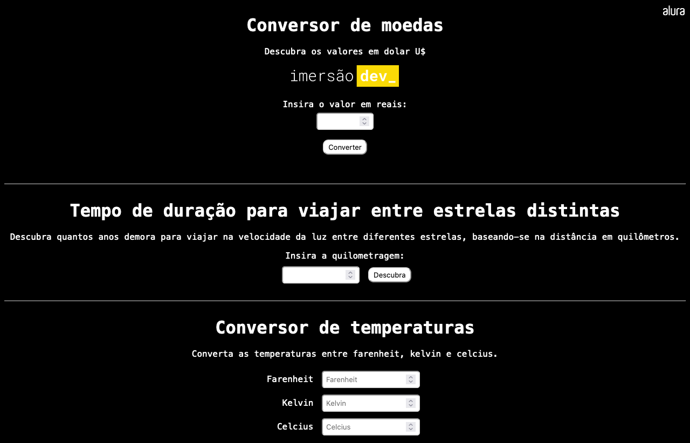

# Conversor de moedas, distâncias e temperaturas

### Screenshot

https://imersao.dev/aulas/aula02-conversor-moedas

### Conteúdo detalhado desta aula:

- Interagir com usuário para receber os preços a serem convertidos;
- Criar a lógica para saber como converter;
- Utilizar funções que interagem com a tela;
- Exibir o resultado na tela com innerHTML.

### Desafios desta aula!

- [x] Adicionar outras moedas para converter;
- [ ] Conversor de quilômetros para anos luz e verificar o tempo que demora para ir de uma estrela para outra;
- [x] Conversor de temperaturas entre farenheit, kelvin e celcius;
- [x] Adicionar uma linha ao projeto desenvolvido para que apareça o valor em bitcoin.

A [Pen](https://codepen.io/rhatiro/pen/yLjONvy) by [rhatiro](https://codepen.io/rhatiro) on [CodePen](https://codepen.io).

[License](https://codepen.io/license/pen/yLjONvy).
